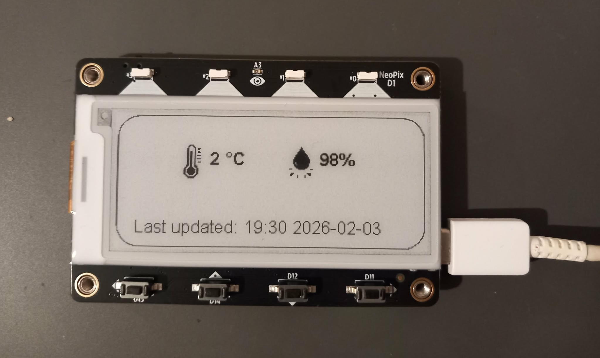
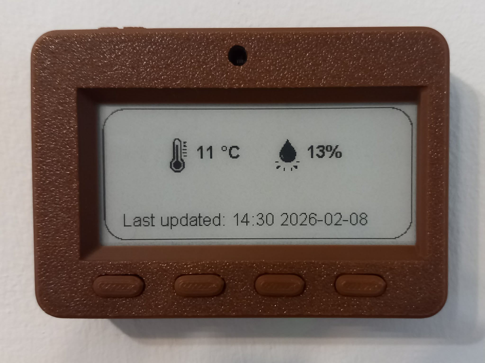

# Weather Gadget

A weather gadget using MagTag and CircuitPython.

## Hardware

- Adafruit MagTag - 2.9" Grayscale E-Ink WiFi Display
- LiPoly Battery 3.7V 500mAh
- Flashforge Adventurer 5M

## Acknowledgement

Original CADs from [here](https://learn.adafruit.com/magtag-case/cad-files).